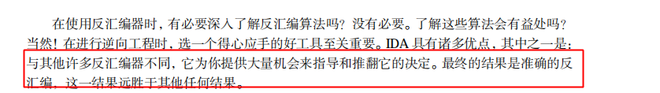
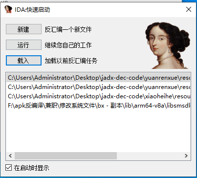
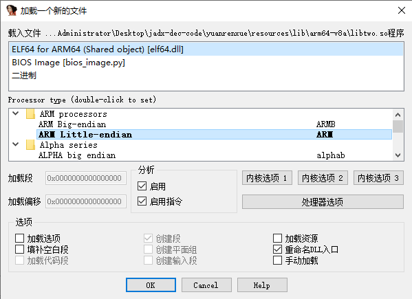
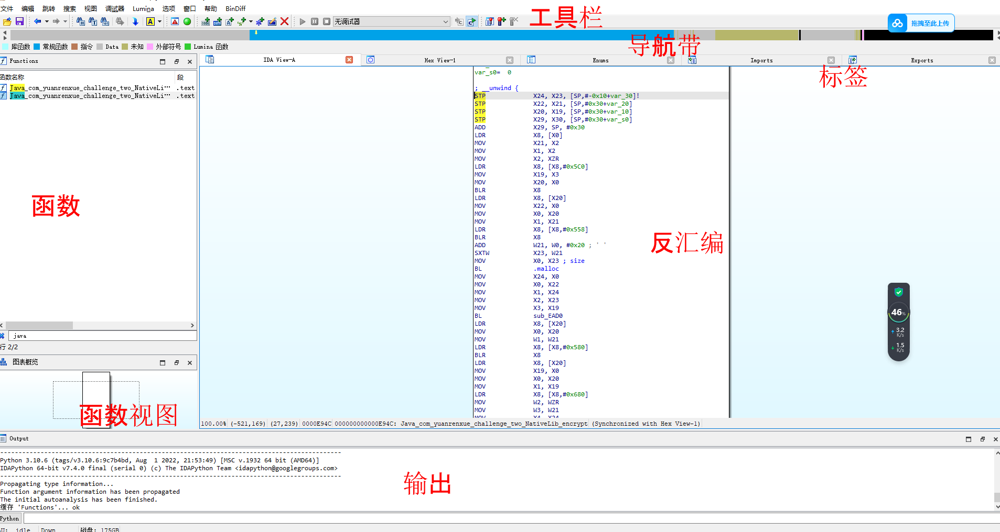
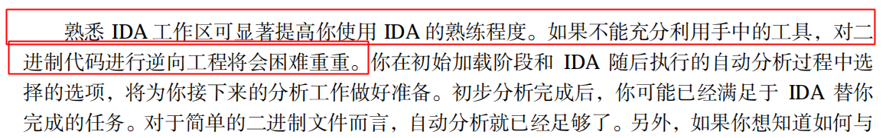

# 基础部分

## 反汇编算法

- 线性扫描反汇编（难以将嵌入的代码 数据分开，）gdb 和微软的gdb均采用线性扫描算法

- 递归下降反汇编 （强调控制流 根据一条汇编指令是否被另一条引用来进行反汇编）
  - cpu对指令指针影响分类
    - 顺序流指令  ，mov pop push都是以线性方式扫描
    - 线性分支指令，条件真 ，指令指针修改跳转到分支目标反汇编，false继续线性，如果运行时则稍后反汇编
    - 无条件分支指令 (不遵守线性扫描规则)
    - 函数调用指令 （call eax 将call地址添加到推迟反汇编的队列，调用后面的指令类似线性扫描进行反汇编）

## 逆向与反汇编工具

- file 可以识别文件格式通过bit特征
- nm 列举目标文件符号
- ldd 是一个命令行工具，用于显示程序所需的共享库依赖项。
- objdump 反汇编 分析调试目标可执行文件
- otool 类似objdump
- dumpbin 微软出品 可解析调试pe文件

# ida入门

ida选择一个解压app包下的so文件 通过文件格式自动推理加载器，不熟悉得用户直接进入即可

### ida数据库文件

- id0 二叉树数据库
- id1 描述程序的标记
- .nam names 位置信息的索引
- .til 给定数据库的本地类型定义有关的信息

### ida桌面

+ 工具栏
+ 导航带
+ 标签（各种数据）
+ 反汇编视图
+ 输出窗口
+ 函数窗口

### ida初始界面分析

- 消息输出窗口的进度
- 反汇编的初始位置和反汇编输出
- functions窗口初始值以及更新
- 二进制数据被识别为代码和数据 代码进一步识别函数，以及函数识别为代码块时候引起的导航带变化情况

# 显示窗口

## ida主要窗口

ida图形视图，可对图元素进行平移，分组，折叠，新建图形窗口辅助自己做事情

汇编代码窗口

函数窗口

输出窗口

## 次要窗口

- 16进制窗口
- 导出窗口 导出函数
- 导入窗口 导入函数
- 结构体窗口 
- 枚举窗口 类似结构体窗口

## 其他窗口

- strings窗口
- names窗口  列举二进制文件所有全局名称
- 段窗口
- 签名窗口
- 类型库窗口
- 函数调用窗口
- 问题窗口 显示反汇编遇到的困难，可人工干预

# 反汇编导航

高效浏览代码的基本思路技巧

## ida基本导航

- 双击导航
- 搜索框 跳转到地址
- 导航历史记录

## 栈帧

## 搜索数据库

- 文本搜索
- 二进制搜索

# 反汇编操作

由于ida的基础是数据库，反汇编做的任何修改都会很快扩散到ida所有子窗口，而且这个过程不可撤销

## 名称与命名

参数与局部变量

参数与局部变量

已命名的位置

寄存器名称

ida注释

常规注释

可重复注释

在前注释

在后注释

函数注释

## 基本代码转换问题

ida提供的代码转换包括以下几类

数据转代码

代码转数据

指定一个指令序列为函数

更改现有函数开始和末尾地址

更改指令操作数的显示格式

？？？

