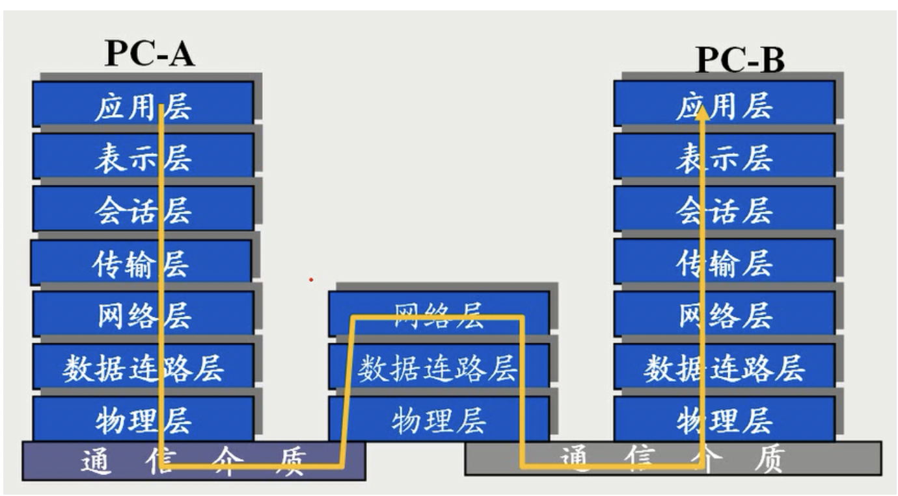
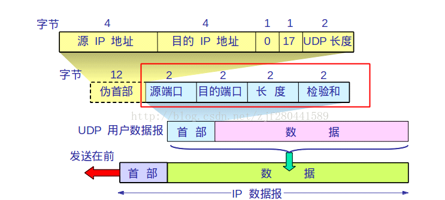
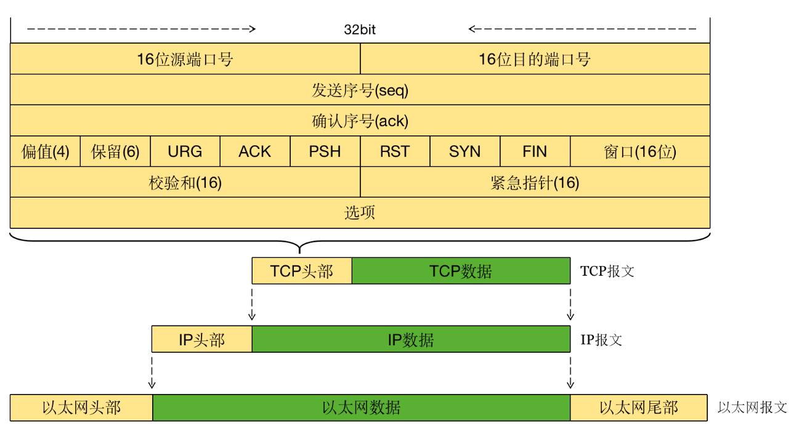

# SSL/TLS 协议

传输层安全性协议（Transport Layer Security，TLS），TLS 是 SSL（Secure Sockets Layer）的继承者和升级版本 ，https=http+tls，多种加密技术和子协议来确保http数据传输的安全性。

## tls应用

https，ftps，smtp，smap，pop3，vpn，dns

##### **TLS 1.0（1999 年发布）**

基于 SSL 3.0，引入 HMAC（Hash-based Message Authentication Code）以提高数据完整性验证的强度。支持更强的加密算法，如 3DES。

**TLS 1.1（2006 年发布）**

CBC（Cipher Block Chaining）模式的保护，防止特定的攻击如 BEAST（Browser Exploit Against SSL/TLS），在每个记录中引入显式 IV，增强了对抗重放攻击的能力。

**TLS 1.2（2008 年发布）**

引入了 SHA-256 作为默认的哈希算法，支持新的加密算法，如 AES-GCM（Galois/Counter Mode）增强性能和可扩展性。

**TLS 1.3（2018 年发布）**

- 握手过程简化，减少了往返时间（RTT），提高了连接速度。

- **默认前向保密**：强制使用前向保密的密钥交换算法（如 ECDHE），确保会话密钥即使泄露也不会影响以前的会话。
- **移除不安全算法**：移除了许多不安全的加密算法和密码套件，如静态 RSA 和静态 DH 密钥交换。
- **改进的加密模式**：引入 AEAD（Authenticated Encryption with Associated Data）模式，如 AES-GCM 和 ChaCha20-Poly1305，提供更高的安全性和性能。
- **0-RTT 支持**：支持 0-RTT（Zero Round-Trip Time）握手，可以在某些情况下减少握手时间，提高连接速度。

#### 2. 基础知识

- 

从传输层说起 运输层之上面向用户功能提供通信服务，传输层之下的网络层和数据链路层则负责面向硬件的点对点传输，而一般路由器转发数据只工作到网络层数据。

传输层实现的两个主要载体 UDP（用户数据报协议） TCP（传输控制协议） 

## UDP

udp 数据头（仅占用8字节） + 数据

**源端口号（Source Port Number）**：16 位，用于标识发送端应用程序的端口号。

**目的端口号（Destination Port Number）**：16 位，用于标识接收端应用程序的端口号。

**长度（Length）**：16 位，用于指示整个 UDP 数据报的长度，包括头部和数据部分。

**校验和（Checksum）**：16 位，用于验证数据的完整性。如果不计算校验和，可以设置为 0。

**数据（Data）**：可变长度，包含实际要传输的数据。

## TCP

**源端口号（Source Port Number）**：

- 16 位，用于标识发送端应用程序的端口号。

**目的端口号（Destination Port Number）**：

- 16 位，用于标识接收端应用程序的端口号。

**序列号（Sequence Number）**：

- 32 位，用于标识发送的字节流中的数据字节的序号。

**确认号（Acknowledgment Number）**：

- 32 位，表示期望接收的下一个字节的序号，仅在 ACK 标志设置时有效。

**数据偏移（Data Offset）**：

- 4 位，表示 TCP 头部的长度，以 32 位（4 字节）为单位。

**保留字段（Reserved）**：

- 3 位，保留供将来使用，必须为 0。

**标志位（Flags）**：

- 9 位，包含多个标志位，用于控制数据传输。
  - **URG**：紧急指针有效。
  - **ACK**：确认号有效。
  - **PSH**：接收方应尽快将数据推送给应用层。
  - **RST**：复位连接。
  - **SYN**：同步序列号，用于建立连接。
  - **FIN**：发送方完成发送数据。

**窗口大小（Window Size）**：

- 16 位，用于流控制，表示接收方愿意接收的字节数。

**校验和（Checksum）**：

- 16 位，用于验证头部和数据的完整性。

**紧急指针（Urgent Pointer）**：

- 16 位，仅在 URG 标志设置时有效，指示紧急数据的结束位置。

**选项（Options）**：

- 可变长度，包含可选的控制信息，如最大报文段长度（MSS）、时间戳等。

**数据（Data）**：

- 可变长度，包含实际传输的数据。

| 特性             | TCP（传输控制协议）                                      | UDP（用户数据报协议）                            |
| :--------------- | :------------------------------------------------------- | ------------------------------------------------ |
| **协议类型**     | 面向连接的协议                                           | 无连接的协议                                     |
| **传输方式**     | 数据流传输                                               | 数据报文传输                                     |
| **可靠性**       | 提供可靠的传输，通过确认、重传和序列控制保证数据完整性   | 不提供可靠的传输，不保证数据到达和顺序           |
| **连接建立**     | 需要建立连接（三次握手）                                 | 无需建立连接，直接发送数据                       |
| **数据传输顺序** | 保证数据按顺序到达                                       | 不保证数据按顺序到达                             |
| **流控制**       | 提供流控制机制，使用滑动窗口协议                         | 不提供流控制                                     |
| **拥塞控制**     | 提供拥塞控制机制，通过慢启动、拥塞避免等算法             | 不提供拥塞控制                                   |
| **头部大小**     | 较大（至少20字节）                                       | 较小（8字节）                                    |
| **效率**         | 较低，由于连接建立、流控制和拥塞控制的开销较大           | 高效，由于无连接和较小的头部开销                 |
| **使用场景**     | 适用于需要可靠传输的应用，如文件传输、电子邮件、网页浏览 | 适用于实时应用，如视频流、在线游戏、语音通信     |
| **错误检测**     | 使用校验和，确认和重传机制确保数据完整性                 | 仅使用校验和进行错误检测，不保证数据重传和完整性 |
| **连接状态**     | 有状态协议，记录连接的状态信息                           | 无状态协议，每个数据报独立处理                   |
| **数据传输单位** | 段（Segment）                                            | 数据报（Datagram）                               |
| **应用层协议**   | HTTP, HTTPS, FTP, SMTP, Telnet                           | DNS, DHCP, TFTP, SNMP                            |

**加密基础**

对称加密 vs. 非对称加密

公钥、私钥和证书

哈希函数和消息摘要

**网络协议基础**

TCP/IP 协议栈概述

HTTP 和 HTTPS 的基本概念和区别

#### 3. TLS 协议概述
**TLS 协议结构**

记录协议（Record Protocol）

握手协议（Handshake Protocol）

警报协议（Alert Protocol）

变更密码规范协议（Change Cipher Spec Protocol）

**TLS 协议版本**

SSL 1.0, 2.0, 3.0

TLS 1.0, 1.1, 1.2, 1.3 的主要区别和特性

#### 4. 握手过程
   - **TLS 1.2 握手过程**

客户端 Hello

服务器 Hello

证书交换

密钥交换

生成会话密钥

握手完成

**TLS 1.3 握手过程**

0-RTT 和 1-RTT 握手

简化的握手步骤

**握手过程中的消息详解**

#### 5. 密钥交换算法
   - **RSA**

RSA 的原理和应用

**Diffie-Hellman (DH)**

基本原理和应用

**椭圆曲线 Diffie-Hellman (ECDH)**

ECDH 的优势和应用场景

**DHE 和 ECDHE 的差异和选择**

#### 6. 加密算法和哈希算法
**对称加密算法**

常见算法：AES, ChaCha20

**哈希算法**

SHA-256, SHA-3 等常见哈希算法

**消息认证码 (MAC)**

HMAC 的工作原理和应用

#### 7. 证书和认证
**数字证书的结构**

X.509 证书格式详解

证书链和信任链

**证书颁发机构 (CA)**

CA 的角色和工作原理

自签名证书 vs. 受信任的证书

**证书管理**

证书颁发、吊销和更新

CRL 和 OCSP 的工作原理

#### 8. 安全性和常见攻击
**中间人攻击 (MITM)**

原理和防御措施

**重放攻击**

原理和防御措施

**常见漏洞分析**

Heartbleed, POODLE, BEAST 等漏洞详解

**防御措施**

使用强加密算法

HSTS (HTTP Strict Transport Security)

证书透明度 (Certificate Transparency)

#### 9. TLS 配置和实现
**服务器端配置**

Apache 和 Nginx 的 TLS 配置

配置最佳实践和常见错误

**客户端配置**

浏览器和应用中的 TLS 配置

**证书获取和配置**

使用 OpenSSL 生成证书

获取和配置 Let’s Encrypt 免费证书

**测试和验证**

使用在线工具和命令行工具测试 TLS 配置

#### 10. 性能优化
**减少握手延迟**

会话重用

TLS 1.3 的性能改进

**优化证书链**

减少中间证书数量

**使用 HTTP/2**

HTTP/2 的优势和与 TLS 的关系

