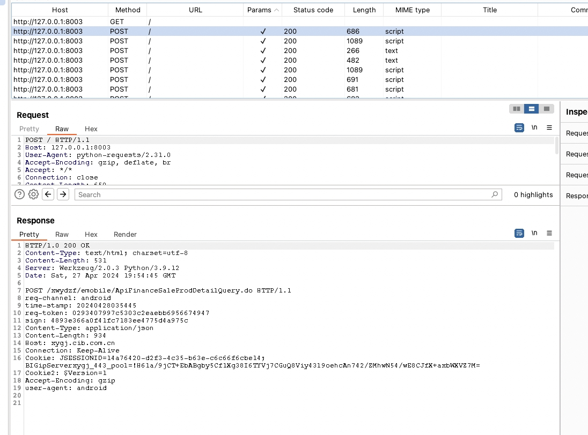

# 启动frida

```shell
# 服务端安装fria
# https://github.com/frida/frida/releases
# 寻找对应机型 arm x86 下载指令版本frida

adb push frida-server-xxx /data/local/tmp

adb shell

su

cd /data/local/tmp

# 改名 不要包含frida 反调试尝试
mv frida-server-xx fs14


chmod -R 777 fs14

./fs14 
# 如果必要切换端口号

./fs14 -l 0.0.0.0 9999 #(xxx?或者其他)


# 客户端安装froda
pip install frida==14.1.3
pip install frida-tools

# 打印模拟器或者手机的进程列表说明frida准备成功
frida-ps -U

```

#  安装某app

```shell
adb install xxx.apk

# 打开某个app 查看包名
adb shell dumpsys window windows | grep mCurrentFocus 

```

## 定位frida反调试的位置

不需要操作，数值已经计算，如果更换版本需要重新计算地址

```js
function get_offset() {
    var result = []
    var pthread_create_addr = Module.findExportByName(null, 'pthread_create')
    var pthread_create = new NativeFunction(pthread_create_addr, "int", ["pointer", "pointer", "pointer", "pointer"]);

    Interceptor.replace(pthread_create_addr, new NativeCallback(function (parg0, parg1, parg2, parg3) {
        var so_name = Process.findModuleByAddress(parg2).name;
        var so_path = Process.findModuleByAddress(parg2).path;
        var so_base = Module.getBaseAddress(so_name);
        var offset = parg2 - so_base;
        var PC = 0;
        if ((so_name.indexOf("libexec.so") > -1)) {
            console.log("find thread func offset", so_name, offset);
            result.push(offset)
            console.log(offset)
        } else {
            PC = pthread_create(parg0, parg1, parg2, parg3);
        }
        return PC;
    }, "int", ["pointer", "pointer", "pointer", "pointer"]))
    return result
}
get_offset()

//打印出来的地址全部是调用pthread的地址 把这些创建线程的调用全部置空 看下面代码


```

## 定位地址写入下面的代码 

```js

function hook_pthread() {

    var pthread_create_addr = Module.findExportByName(null, 'pthread_create');

    var pthread_create = new NativeFunction(pthread_create_addr, "int", ["pointer", "pointer", "pointer", "pointer"]);
    Interceptor.replace(pthread_create_addr, new NativeCallback(function (parg0, parg1, parg2, parg3) {
        var so_name = Process.findModuleByAddress(parg2).name;
        var so_path = Process.findModuleByAddress(parg2).path;
        var so_base = Module.getBaseAddress(so_name);
        var offset = parg2 - so_base;
        var PC = 0;
        if ((so_name.indexOf("libexec.so") > -1)) {
            console.log("find thread func offset", so_name, offset);
            if ((283996 === offset)) { //打印出来的代码写到if判断进行绕过
                console.log("anti bypass");
            } else if (287404 === offset) {
                console.log("anti bypass");
            } else if (299404 === offset) {
                console.log("anti bypass");
            } else if (299932 === offset) {
                console.log("anti bypass");
            } else {
                PC = pthread_create(parg0, parg1, parg2, parg3);
            }
        } else {
            PC = pthread_create(parg0, parg1, parg2, parg3);
        }
        return PC;
    }, "int", ["pointer", "pointer", "pointer", "pointer"]))
}

hook_pthread();

```

将上面代码复制到js文件

## 启动frida 反调试脚本

frida -U -f com.yitong.mbank.xy -l frida-bypass.js --no-pause


# r0capture 绕过证书进行抓包转发burp 

开启burp 端口8003

```js
启动抓包脚本 具体见附件代码

python r0capture.py -U com.yitong.mbank.xy -v -p net.pcap

```



补充

因为hook的比较底层 有时候burp转发多次数据后 app才会发送一部分请求

加密算法刚还原了二代壳代码 时间因素还没支持，可以先把流程打通

